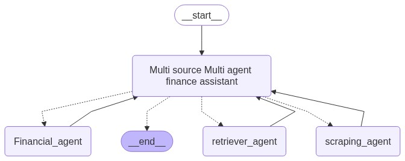

# Multi-Source Multi-Agent Finance Assistant

A powerful finance assistant that leverages multiple AI agents to provide comprehensive financial information and insights from various sources.

## 🏗️ Architecture



The system is built using a multi-agent architecture with the following components:

### Core Components

1. **Orchestrator**
   - Manages communication between different agents
   - Handles request routing and response aggregation
   - Built with FastAPI for high-performance API endpoints

2. **Agents**
   - **Voice Agent**: Handles speech-to-text and text-to-speech conversions
   - **API Agent**: Interfaces with financial APIs (e.g., yfinance)
   - **Retriever Agent**: Manages document retrieval and processing
   - **Scraping Agent**: Extracts financial information from web sources

3. **Data Ingestion**
   - Handles data collection and preprocessing
   - Supports multiple data sources and formats

4. **Streamlit Frontend**
   - User-friendly web interface
   - Real-time interaction with the multi-agent system
   - Voice input/output capabilities

## 🛠️ Setup & Deployment

### Prerequisites
- Python 3.12+
- Docker (for containerized deployment)
- Google Cloud API credentials (for Gemini AI)

### Local Development Setup

1. Clone the repository:
```bash
git clone https://github.com/yourusername/multi-source-multi-agent-finance-assistant.git
cd multi-source-multi-agent-finance-assistant
```

2. Create and activate a virtual environment:
```bash
python -m venv venv
source venv/bin/activate  # On Windows: venv\Scripts\activate
```

3. Install dependencies:
```bash
pip install -r requirements.txt
```

4. Set up environment variables:
```bash
cp .env.example .env
# Edit .env with your API keys and configuration
```

5. Run the application:
```bash
# Start the orchestrator
uvicorn orchestrator.main:app --host 0.0.0.0 --port 8000

# In a separate terminal, start the Streamlit app
streamlit run streamlit_app/app.py
```

### Docker Deployment

1. Build the Docker image:
```bash
docker build -t finance-assistant .
```

2. Run the container:
```bash
docker run -p 8000:8000 -p 8501:8501 finance-assistant
```

## 🚀 Framework & Toolkit Comparison

| Component | Technology | Benefits |
|-----------|------------|----------|
| Backend Framework | FastAPI | High performance, async support, automatic API documentation |
| Frontend | Streamlit | Rapid development, interactive widgets, easy deployment |
| AI Framework | LangChain | Modular agent architecture, extensive tool integration |
| Vector Store | FAISS | Efficient similarity search, optimized for large datasets |
| Speech Processing | SpeechRecognition + gTTS | Cross-platform support, multiple language support |

## 🔑 Key Features

- Multi-source financial data aggregation
- Voice-based interaction
- Real-time market data processing
- Document analysis and summarization
- Interactive financial visualizations
- Cross-platform compatibility

## 🤝 Contributing

Contributions are welcome! Please feel free to submit a Pull Request.

## 📝 License

This project is licensed under the MIT License - see the [LICENSE](LICENSE) file for details.
